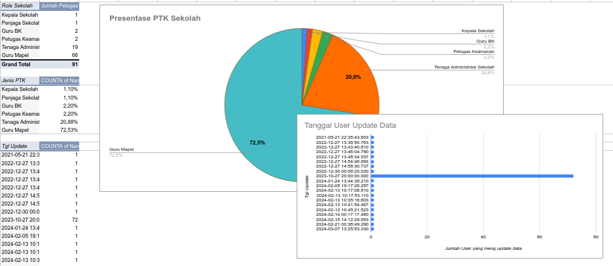

# The DAT4$ Br#cker

Disini kita dapat melihat bagaimana kita bisa sejauh ini

---

dari komputer-komputer yang sebelumnya kita pivoting,saya mendapatkan akses dengan low user privillage di komputer admin,walaupun begitu saya memanfaatkan itu untuk melakukan **Privilege escalation**, 

setelah mendapatkan akses ke komputer-komputer yang menjadi pasukan zombie saya,saya mendapatkan 3 **Data Faktor**

- Dokumen
    - Karya Tulis Ilmiah
    - Leger Data Rapot Siswa semua jurusan
    - Backup data raport
    - Backend dan Frontend kerangka website input Nilai Rapot
- Wifi Log
    - Password-password wifi sekolah
        
        *Ini adalah titik saya bisa menyebar lebih banyak Corpse di sekolah*
        
- **PASSWORD DAN KREDENSIAL**
    - data ini berupa Password-password yang ada di website maupun di Note komputer dimana admin sengaja meninggalkan password ini untuk sewaktu-waktu ingin digunakan kembali

Dari ketiga **Faktor**, yang paling menarik adalah data ke-3, yaitu **Password dan Kredensial**. Password dan kredensial berisi situs-situs yang pernah diakses oleh komputer dengan kredensial yang sudah ada di catatan sebelumnya. Akhirnya, kita mendapatkan sebuah tabel seperti ini:
## Data Leaked
| Jenis data yang ter-Leak | Integrasi yang terdampak |
| --- | --- |
| Nama Lengkap  | Siswa,Guru |
| Alamat Rumah | Siswa,Guru |
| Provinsi | Siswa,Guru |
| Kota | Siswa.Guru |
| Nomor Telepon | Guru |
| Email | Guru |
| NIPD | Siswa |
| NISN | Siswa |
| NUPTK | Guru |
| Jenis PTK | Guru |
| Tempat Lahir | Siswa,Guru |
| Tanggal Lahir | Siswa,Guru |
| Jenis Kelamin | Siswa,Guru |
| Nama Orang tua | Siswa |
| Jurusan | Siswa |
| Ibu Kandung | Siswa,Guru |
| Status Perkawinan | Guru |
| Nama Suami/Istri | Guru |
| NPWP | Guru |
| Masih banyak  | Siswa,Guru |

Tidak hanya itu, saya juga telah menyiapkan Tabel Pivot untuk data yang telah saya kumpulkan, serta menyortir dan membersihkan data yang duplikat.




### Data Tambahan
beberapa contoh kecil data yang saya kumpulkan seperti:
#### User Website Sekolah Resmi
```css
Wordpress 
    User {
        -acep
        -laras
        -smantisu3
        -suratman
        -gls
        -kusman-rukaman
        -harun
        -adilana
}

```
#### Data Pribadi
```mdx
                              __
                            .d$$b
                          .' TO$;\
                         /  : TP._;
                        / _.;  :Tb|
                       /   /   ;j$j
                   _.-"       d$$$$
                 .' ..       d$$$$;
                /  /P'      d$$$$P. |\
               /   "      .d$$$P' |\^"l
             .'           `T$P^"""""  :
         ._.'      _.'                ;
      `-.-".-'-' ._.       _.-"    .-"
    `.-" _____  ._              .-"
   -(.g$$$$$$$b.              .'
     ""^^T$$$P^)            .(:
       _/  -"  /.'         /:/;
    ._.'-'`-'  ")/         /;/;
 `-.-"..--""   " /         /  ;
.-" ..--""        -'          :
..--""--.-"         (\      .-(\
  ..--""              `-\(\/;`
    _.                      :
                            ;`-
                           :\
                           ;  OSINT
			  __  __  ___   ___  _____   __
			 |  \/  |/ _ \ / _ \|   \ \ / /  
			 | |\/| | (_) | (_) | |) \ V / 
			 |_|_ |_|\___/_\___/|___/ |_|  
			 | _ ) | | | | | __/ __|       
			 | _ \ |_| |_| | _|\__ \       
			 |___/____\___/|___|___/   
|--<IDENTITAS>--|
    Nama	: █████ ████████
    Alamat Rumah: Dusun ███████████, ███████████, Kecamatan ███████, Kabupaten Sumedang, Jawa Barat █████, Indonesia
    Telepon Rumah (RT/RW): 1/█
    Provinsi	: Jawa Barat
    Kota	: Kabupaten Sumedang
    Kode Pos	: █████
    Kecamatan	: Kecamatan ███████
    Nomor Telepon: ████████████
    Nomor HP	: █████████████
    Email	: ██████████████@gmail.com
    Email Resmi	: ██████████████████@jabarprov.go.id

|--<DATA PRIBADI>--|

    No. KTP	: ████████████████
    No. NPWP	: 24.457.470.█-███-000
    Golongan Darah: B
    NUPTK	: ████████████████

|--<KEPERGAWAIAN>--|

    Jenis ASN	: PNS
    Status Calon Pegawai: PNS Daerah Provinsi yang bekerja pada Provinsi
    Kedudukan PNS	: Guru Ahli Madya

|--<PENDIDIKAN>--|:

    Pendidikan Awal: SD
    Pendidikan Akhir: S1
    Jenis Jabatan: Fungsional Tertentu (Guru)
```
```mdx
			      \
				\\
				 \%,     ,'     , ,.
				  \%\,';/J,";";";;,,.
		     ~.------------\%;((`);)));`;;,.,-----------,~
		    ~~:           ,`;@)((;`,`((;(;;);;,`         :~~
		   ~~ :           ;`(@```))`~ ``; );(;));;,      : ~~
		  ~~  :            `X `(( `),    (;;);;;;`       :  ~~
		 ~~~~ :            / `) `` /;~   `;;;;;;;);,     :  ~~~~
		~~~~  :           / , ` ,/` /     (`;;(;;;;,     : ~~~~
		  ~~~ :          (o  /]_/` /     ,);;;`;;;;;`,,  : ~~~
		   ~~ :           `~` `~`  `      ``;,  ``;" ';, : ~~
		    ~~:                             `'   `'  `'  :~~
		     ~`-----------------------------------------`~
				  __  __  ___   ___  _____   __
				 |  \/  |/ _ \ / _ \|   \ \ / /  
				 | |\/| | (_) | (_) | |) \ V / 
				 |_|_ |_|\___/_\___/|___/ |_|  
				 | _ ) | | | | | __/ __|       
				 | _ \ |_| |_| | _|\__ \       
				 |___/____\___/|___|___/ 
	|--<IDENTITAS>--|
Nama Lengkap           :  ████ ███ ████████
Jenis Kelamin          :  Laki-Laki
NIP                    :  ██████████████████
NIK                    :  ████████████████
NUPTK                  :  ████████████████
Tempat Lahir           :  Sumedang
Tanggal Lahir          :  ████-05-25
Ibu Kandung            :  ██████████
Agama                  :  Islam
No HP                  :  ████████████
Email                  :  ███████████████@gmail.com
Status Perkawinan      :  Nikah
Nama Suami/Istri       :  ████ █████ ███████
NIP Suami/Istri        :  ██████████████████
Pekerjaan Suami/Istri  :  PNS/TNI/Polri
NPWP                   :  ██████████████████
____________________________________________________________________________
	|--<DOMISILI>--|
Alamat                  :  Jl.█████ ████████ █████
Nama Dusun              :  █████
RT                      :  2
RW                      :  █
Desa/Kelurahan          :  █████
Kecamatan               :  Kec. Sumedang █████
Kabupapten              :  Kab. Sumedang
Propinsi                :  Prov. Jawa Barat
Kode Pos                :  █████
No Telepon Rumah        :  None
```

### Data Raport


#### Login Aplikasi e-Rapor Kurikulum Merdeka dan Kurikulum 2013 Jenjang SD, SMP, SMA, SMK, SLB

| No | Username | Nama User | Password |
| --- | --- | --- | --- |
| 1 | █u█u██u█s█nr█y███ | █u█u█ █u█s█n R█y███ | eraporkm123456 |
| 2 | n█n█n██r██nsy██ | N█n█n ██r██nsy██ | eraporkm123456 |
| 3 | nur█nnynov██us███n█ | Nur█nny Nov██us███n█ | eraporkm123456 |
| 4 | r█n█nur███n█ | R█N█ NUR███N█ | eraporkm123456 |
| 5 | 198010192021212 | Yu███ ██r█sn█w█t█ | eraporkm123456 |
| 6 | █.█.█o██r | █.█. █o██r | eraporkm123456 |
| 7 | ████n█su███n█ | ████n█ Su███n█ | eraporkm123456 |
| 8 | ████nso██ntr█ | ████n So██ntr█ | eraporkm123456 |
| 9 | ██n███r██w█n | ██n█ ██r██w█n | eraporkm123456 |
| 10 | ██ssynurr████w█t█ | ██ssy Nur R████w█t█ | eraporkm123456 |
| 11 | ████████r██ns██ | ███ ███ ██r██ns██ | eraporkm123456 |
| 12 | ██n█w█n█n█s██ | ██n█ W█n█n█s██ | eraporkm123456 |
| 13 | █u██nu█r███ | █u██ Nu█r███ | eraporkm123456 |
| 14 | █████ry█t█ | ███ ██ry█t█ | eraporkm123456 |
| 15 | █nun█nur██n█ | █nun█ Nur██n█ | eraporkm123456 |
| 16 | █uw█t█r████urn██w█t█,s█ | █UW█T█ R███ █URN██W█T█, S█ | eraporkm123456 |
| 17 | ███su███s██ | ███ Su███s██ | eraporkm123456 |
| 18 | r█st█sr█ut███ | R█ST█ SR█ UT███ | eraporkm123456 |
| 19 | ru██n██r | Ru██n██r | eraporkm123456 |
| 20 | s█n█y███r████nto | S█n█y ███r████nto | eraporkm123456 |
| 21 | sr███w██n███n█ | Sr█ ██w█ █n███n█ | eraporkm123456 |
| 22 | sun██r██pr████ | SUN██R█ █PR████ | eraporkm123456 |
| 23 | sus█nt███tr███w█ | Sus█nt█ ██tr█ ██w█ | eraporkm123456 |
| 24 | t█t█nt█u██q█ | T█t█n T█u██q█ | eraporkm123456 |
| 25 | t█t███n█y█t████r█y██ | T█t█ ██n█y█t█ ███r█y██ | eraporkm123456 |
| 26 | tr██nny█pr█████ | Tr██nny █pr█████ | eraporkm123456 |
| 27 | w█n███yu███n█y██ | W█N██ █YU ███N█Y██ | eraporkm123456 |
| 28 | y█y█nsury█n█ | Y█y█n Sury█n█ | eraporkm123456 |
| 29 | r████t████y█t | R████t ████y█t | eraporkm123456 |
| 30 | _ | ██rry █████sy█ Putr██n█ | eraporkm123456 |

#### Rapor Nilai Biologi kelas

| NO | Nama Siswa | NISN | NIS | NILAI RAPOR SISWA |
| --- | --- | --- | --- | --- |
| 1 | ███ ████ ██t██w██ | ██7█8██89█ | █████0███ | 76 |
| 2 | ████ty█ ██z█y █u█r███ | ██89█7██6█ | █████0██6 | 78 |
| 3 | █████ █████ | ██96█777█7 | █████0██7 | 77 |
| 4 | ████ ███ ██████████ | ██8█9█9██7 | █████0██8 | 82 |
| 5 | ██████ ███ ███████ | ██77█████6 | █████0██9 | 80 |
| 6 | ██sr█ ███z███y | ██76████7█ | █████0██0 | 79 |
| 7 | ██z█r ████y ██rw███ | ██7██7██99 | █████0███ | 78 |
| 8 | █r██s██ █uro████t | ██8████79█ | █████0███ | 77 |
| 9 | ███████ █████████ | ██8██6█688 | █████0███ | 79 |
| 10 | ██████ ██████ | ██78██████ | █████0█68 | 79 |
| 11 | █████ █████ ███████ | ██79█7█68█ | █████0███ | 82 |
| 12 | ███████ ████z█ | ██87█████7 | █████0███ | 82 |
| 13 | ████████ ███████ ███████████ | ██7███9█6█ | █████0██6 | 80 |
| 14 | ██████r██ █r███ry███ ████r | ██8███97██ | █████0██7 | 79 |
| 15 | ███t█r█ | ██8█6██8██ | █████0██8 | 78 |
| 16 | ███. ██████ █████ ██ ███ ███████ | ██8█66█6█6 | █████0██9 | 78 |
| 17 | █u█████ ███r██ █u█████r ████████ | ██866█87█8 | █████0██0 | 78 |
| 18 | █u█████ ████ | ██8███████ | █████0███ | 76 |
| 19 | ███████ ████ ██████ | ██79██████ | █████0███ | 76 |
| 20 | █u█████ ███w██ ████████ | ██8█87987█ | █████0███ | 79 |
| 21 | █u█████ ██z██ ██uz██ | ██87███9██ | █████0███ | 80 |
| 22 | ████████ ██████ ██ ██████ | ██7███9██6 | █████0███ | 76 |
| 23 | █u██████ ██z█y ████████ | ██79███78█ | █████0██6 | 79 |
| 24 | █u██████ ██y██ █████ | ██86████76 | █████0██7 | 83 |
| 25 | █████ ███ ██████ | ██89█68█7█ | █████0██8 | 83 |
| 26 | ██s█ ███s█████ | ██7███969█ | █████0██9 | 78 |
| 27 | █ur █u███ ███s█ro█ | ██7████8██ | █████0██0 | 83 |
| 28 | █utr█ █u█████ | ██8██9█887 | █████0███ | 78 |
| 29 | ██v███ ██r███ | ██88█989██ | █████0███ | 79 |
| 30 | ████ ██████ ██████ | ██8███████ | █████0███ | 79 |
| 31 | ███w█ ██t█ ██z██ ████y█t ███████r████ | ██7█7668██ | █████0███ | 82 |
| 32 | ███v██ █ors██████ | ██76█8██66 | █████0██6 | 83 |
| 33 | ███r█ ██st█r█ ██████ | ██8████669 | █████0██7 | 80 |
| 34 | █████ ███████████ ██████ | ██88█6█66█ | █████0██8 | 80 |
| 35 | ██s███ ██z██ █████████ | ██7█7█889█ | █████0██9 | 80 |
| 36 | ██████ ██████ ███████a | ██788█8███ | █████0█60 | 76 |

:::caution[Perhatian!]
 data yang ada digambar/tabel mungkin lebih kurang atau lebih dari data yang ada jadi harap diperhatikan
:::

## Kesimpulan yang sudah saya capai sejauh ini:
- [x]  Mengatur router dengan DNS tertentu untuk mengontrol Wifi sekolah dari jarak jauh
- [x]  Dapat mematikan wifi atau menghapus pengguna dari wifi
- [x]  Menggunakan kerentanan komputer di sekolah untuk menyuntikkan backdoor
- [x]  Membuat backdoor yang otomatis berjalan saat Windows dimulai
- [x]  Mengatur server lokal di jaringan wifi untuk memfasilitasi akses ke komputer target
- [x]  Melakukan proses pivoting, menggunakan satu sistem yang telah dikompromikan untuk menyebar ke sistem lain
- [x]  Menggunakan teknik phishing untuk mendapatkan kata sandi wifi
- [x]  Menggunakan teknik social engineering untuk mendapatkan kepercayaan dari orang lain
- [x]  Mengumpulkan data pribadi dari individu melalui berbagai metode, termasuk penggunaan alat seperti Google, Spiderfoot, Maltego, Facebook, Instagram, OSINT Framework, TinEyes, dan alat lainnya di terminal
- [x]  Mengumpulkan dan mengatur data yang telah dikumpulkan ke dalam tabel pivot untuk analisis lebih lanjut