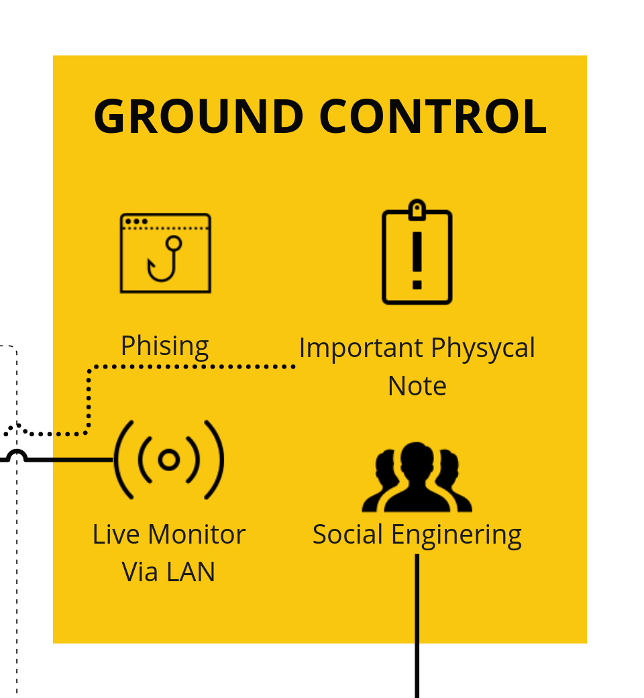

import { Card, CardGrid } from '@astrojs/starlight/components';

Sebelum kita membahas lebih lanjut, ingatlah bagian ini.

Keberhasilan langkah-langkah yang telah dilalui bukanlah hasil dari keajaiban laptop saya, melainkan dari empat struktur penting berikut:

---

Phishing adalah teknik menggunakan situs web palsu untuk menipu korban agar terjebak. Saya menggunakan teknik ini untuk mendapatkan kata sandi wifi dengan cara membuat **Evil Twin**. Alat ini akan memutuskan koneksi wifi target (Deauth) sehingga pengguna tidak bisa mengakses internet. Selanjutnya, alat ini akan meniru wifi target sehingga tampak sama. Pengguna yang panik akan terhubung ke wifi jebakan dan diarahkan ke halaman login wifi, di mana mereka akan memberikan kata sandi wifi. Namun, cara saya mengetahui kata sandi wifi tidak hanya dari sini saja. Saya juga dapat melakukan crack handshake wifi dengan data handshake wifi yang saya crack menggunakan wordlist yang saya miliki.

<Card title="Apa itu Evil-Twin?" icon="magnifier">Evil twin dalam bahasa Indonesia berarti "kembaran jahat". Ini adalah istilah untuk jaringan Wi-Fi palsu yang dibuat menyerupai jaringan Wi-Fi yang sah. Hacker membuat jaringan ini untuk menipu pengguna agar terhubung, sehingga mereka bisa mencuri data sensitif seperti kata sandi atau mengintip aktivitas internet Anda. Bayangkan jaringan Wi-Fi favorit Anda di cafe tiba-tiba memiliki kembaran yang jahal, ia ingin Anda terhubung untuk mencuri informasi Anda!</Card>

---

Catatan fisik yang saya temukan adalah hasil dari kemampuan saya dalam menganalisis. Saya menghabiskan waktu untuk mengamati sekitar sekolah dan menganalisis catatan-catatan yang mungkin ada dan berhasil ditemukan. Beberapa catatan berada di tempat yang aman, namun beberapa catatan lainnya tergeletak begitu saja.

---

Social Engineering tidak hanya terjadi pada sistem komputer, tetapi juga dapat dimanipulasi untuk membuat orang-orang di sekitar percaya.
<Card title="Fact" icon="approve-check">Rekayasa sosial memiliki dua arti yang berbeda, hal ini bisa diartikan sebagai penggunaan perencanaan terpusat dalam upaya untuk mengelola perubahan sosial dan mengatur perkembangan masa depan dan perilaku masyarakat.</Card>

Dengan teknik Social Engineering yang kuat, seseorang dapat merancang kejadian dan merubah perspektif lingkungan terhadap dirinya. Dalam hal ini, saya menggunakan Social Engineering sebagai fondasi proyek ini. Ketika kita bersekolah, kita tidak bisa lari dari stigma buruk siswa-siswa lain terhadap kita. Oleh karena itu, saya mulai bergaul dan berteman untuk mendapatkan kepercayaan mereka.