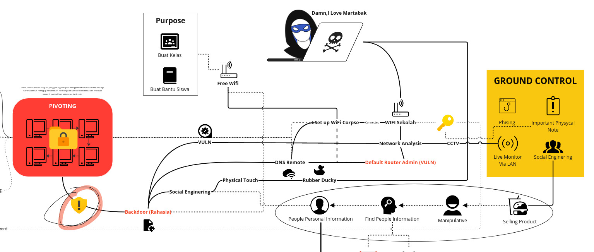

import { Card, CardGrid } from '@astrojs/starlight/components';

ini adalah garis besar  yang perlu kita lihat secara seksama.

---

Dalam step 1 saya masuk ke jaringan sekolah menggunakan password yang tersebar setelah itu saya menganalisis seluruh kerentanan router namun hasil kerentan itu ternyata hanya bisa membantu estalabish koneksi ke backoor saya,tapi yang mengejutkan adalah hampir semua router tidak mengganti default router admin nya yang membuat router bisa saya setting sesuka hati seperti:

1. **Mengubah nama jaringan (SSID) dan kata sandi Wi-Fi.**
2. **Mengatur jenis koneksi internet (misalnya DHCP, PPPoE).**
3. **Membatasi akses internet ke perangkat tertentu.**
4. **Membuat jaringan tamu.**
5. **Mengatur kontrol orang tua untuk membatasi konten web.**
6. **Memperbarui firmware router.**
7. **Melihat statistik penggunaan internet.**

Saya mengoptimalkan fitur ini untuk membuat Wifi tiruan dimana router menyiarkan 2 broadcast wifi,yang 1 dengan Wifi aslinya yang 1 nya yang saya sebut sebagai *Corpse* ,Wifi ke 2 tidak akan tersiarkan karena saya menggunakan fitur Hiding SSID dan hanya bisa di akses jika saya menambahkan Wifi secara manual di Handphone saya.

---

setelah bisa mengakses Wifi saya menjalankan *Wireshark* dan alat sniffing lainnya seperti bettercap,Ettercap,NetDiscover dan alat lainnya,saya menemukan bahwa ada beberapa wifi menyambung ke sebuah alat seperti CCTV,CCTV yang saya maksud adalah CCTV Motorize IP CCTV HD PT Camera C38S yang tersambung menjadi 1 jaringan dengan wifi sekolah,karena mreja berbagi Kabel tranfer yang sama-sama menggunakan kabel LAN, disini saya mendapatkan informasi tambahan tentang struktur Jaringan disekolah.
:::note
Wireshark, Bettercap, Ettercap, dan NetDiscover. Wireshark memungkinkan Anda untuk menangkap dan menganalisis lalu lintas jaringan, Bettercap untuk memanipulasinya, Ettercap untuk melakukan serangan "man-in-the-middle", dan NetDiscover untuk memetakan jaringan. Dengan menggabungkan kekuatan keempat alat ini, Anda dapat mengungkap rahasia tersembunyi, mendeteksi potensi bahaya, dan menjaga keamanan jaringan serta melindungi privasi.
:::
---

kembali lagi ke Router yang sudah saya setting dengan DNS yang sudah saya atur agar wifi mengkoneksikan DNS nya ke DNS yang saya punya (disini saya menggunakan NOIP), ini memudahkan saya untuk mengontrol Wifi sekolah lewat handphone saya walau saya sedang ada diluar jaringan wifi ,contohnya saya bisa mematikan wifi atau kick user yang ada di wifi itu ketika saya sedang bersandar di cafe,selain itu untuk menuju ke poin utama saya melakukan beberapa cara untuk inject backdoor yang saya buat seperti menggunakan kerentanan Komputer-komputer yang ada disekolah,saya sadar bahwa Backdoor yang saya buat sangatlah lemah dimana jika backdoor sudah berjalan file backdoor tidak terhapus,tidak bisa mem bypass system windows defender di windows 7,dan backdoor yang hilang kendali jika komputer yang terinfeksi dimatikan yang akhirnya saya tidak bisa menjalankan backdoor tersebut,namun disitulah saya sadar bahwa untuk melakukannya yaitu dengan set up sebuah server local di jaringan wifi,lalu backdoor yang di atur secara otomatis terbuka saat running windows dan dengan begitu saya bisa meng akses 1 komputer yang saya tujukan untuk proses pivoting

<Card title="Fact" icon="approve-check">pivoting adalah **tindakan
 menggunakan sistem yang telah dikompromikan untuk menyebar di antara 
sistem komputer yang berbeda begitu berada di dalam jaringan, yang 
menyimulasikan perilaku penyerang sebenarnya**</Card>

dengan pivoting ini saya harus tetap monitoring komputer yang sudah saya infeksi secara fisik ,jadi saya selalu cek komputer-komputer tersebut agar tidak terjadi kerusakan yang tidak perlu dan saya lakukan secara hati-hati dengan social enginering untuk masuk ke ruang Lab dan ruangan lain
:::danger[Hal Yang bisa saya lakukan]
- Mengatur router dengan DNS tertentu untuk mengontrol Wifi sekolah dari jarak jauh
- Dapat mematikan wifi atau menghapus pengguna dari wifi
- Menggunakan kerentanan komputer di sekolah untuk menyuntikkan backdoor
- Membuat backdoor yang otomatis berjalan saat Windows dimulai
- Mengatur server lokal di jaringan wifi untuk memfasilitasi akses ke komputer target
- Melakukan proses pivoting, menggunakan satu sistem yang telah dikompromikan untuk menyebar ke sistem lain
:::