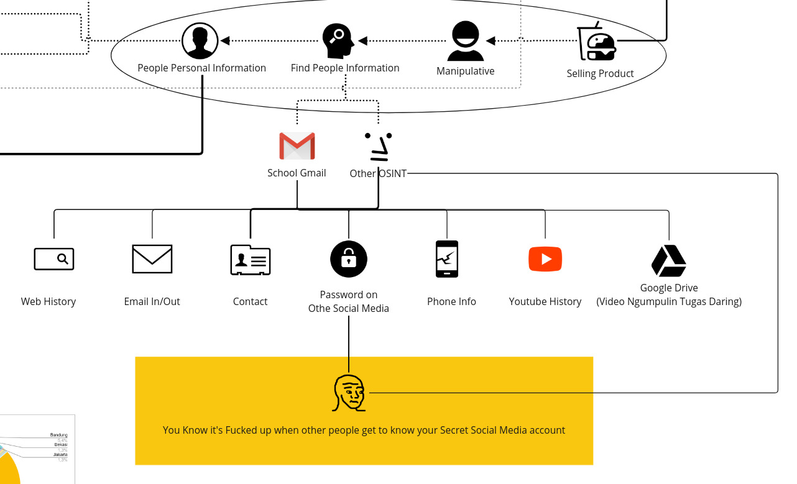
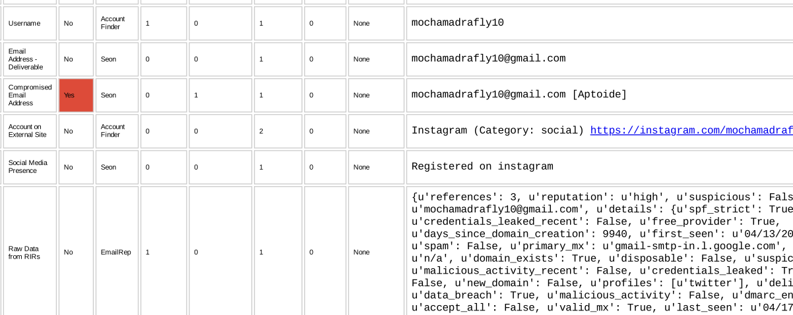
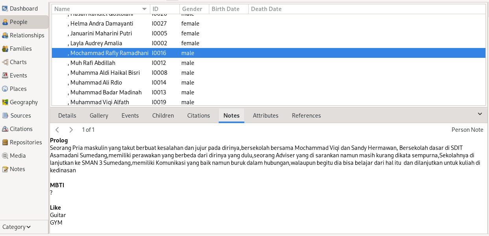

import { Card, CardGrid, LinkCard } from '@astrojs/starlight/components';
import { Icon } from '@astrojs/starlight/components';

### Social Engine

Ini dimana saya mengenal anda

---

<Icon name="seti:yml" size="2rem"/>
Untuk memulai sesi ini, izinkan saya mengungkap satu fakta bahwa **Sebagian besar siswa tidak mengganti password Gmail sekolah mereka**. Hal ini terjadi selama pandemi Covid, ketika siswa terpaksa belajar dari rumah dan mengumpulkan tugas mereka melalui Gmail yang disediakan sekolah. Namun, ...

Meski Gmail hanya berisi video, foto, atau tugas, beberapa siswa bahkan tidak menyadari bahwa Gmail mereka masih terhubung dengan handphone yang mereka miliki. Hal ini memungkinan peretas untuk mengambil berbagai data seperti:

- Riwayat Website
- Isi Email
- Kontak yang terdaftar di Gmail
- Informasi Handphone
- Akses penuh ke Youtube
- Dan password yang tersimpan di Gmail tersebut

Meski seseorang tidak menggunakan Gmail sekolah, data-data tersebut masih bisa diambil. Lalu, mengapa ada orang yang masih menggunakan Gmail sekolah? Mari kita bahas.

---

:::note[Pembahasan]
💡 Gmail Sekolah menawarkan penyimpanan yang tak terbatas, berbeda dengan Gmail biasa yang kita gunakan. Selain itu, akun Gmail Sekolah lebih fleksibel untuk digunakan dalam mengirimkan GDrive. Dari penelitian saya, Gmail Sekolah tidak dapat dilacak menggunakan alat OSINT seperti Spiderfoot atau lainnya. Jadi, tidak mengherankan jika beberapa siswa menggunakan Gmail Sekolah untuk menyimpan foto, chat mantan, presentasi ulang tahun untuk pacar, atau hal-hal yang kurang pantas. Namun, perlu diingat bahwa menyimpan hal-hal tersebut di GDrive sekolah bukan hanya tidak aman tetapi juga dapat memungkinkan pihak yang membuat akun Gmail Sekolah mengetahui apa yang kamu simpan (Administrator sekolah).

:::

Selain itu, beberapa orang lupa jika mereka kadang membuka sebuah link GDrive menggunakan Gmail yang sudah diakses oleh orang lain, dan orang lain dapat melihat link apa yang sudah kamu buka. Tidak hanya itu, saya juga banyak mendapati siswa yang menggunakan situs-situs judi dan hal lainnya di akun Gmail sekolahnya.

### Lalu, jika saya tidak menggunakan Gmail Sekolah, apakah saya aman?

Jawabannya **Tidak**. Karena saya hanya perlu melihat Nama lengkap dari Data sheet Kelas soft files dan melihat wajahnya dengan foto formal latar merah/biru mereka di GDrive. Dengan kedua data itu, saya sudah cukup bisa melakukan pencarian data pribadi. Namun, tentu saya tidak melakukan ini secara manual. Saya dibantu beberapa alat seperti:

- Google
- Spiderfoot
- Maltego
- Facebook
- Instagram
- OSINT Framework
- TinEyes
- dan alat-alat di terminal lainnya (Sherlock, Shodan, dll)

Mungkin kalian tidak begitu familiar dengan alat-alat di atas, tapi itu tidak masalah karena saya tidak selalu menggunakan mereka. Terkadang, saya menggunakan alat yang lebih sederhana seperti notepad atau alat tulis.

### Tapi anda tidak bisa masuk sembarangan apalagi membobol gmail orang

**Ya Itu benar**, saya tidak akan sampai mencoba untuk mencoba *Cracking* akun gmail seseorang,alasannya karena :

- Memakan waktu
- Melanggar kode etik
- Password google dibuat aman
- Notfikasi jika saya mencoba membobol akun seseorang
- Malas

Faktanya,walaupun begitu saya masih bisa mencari data seseorang lebih detail hanya dengan nama gmailnya,seperti ini:

Dari gambar diatas saya mendapatkan beberapa informasi hanya dari nama gmail yang tersebar,ini adalah hal yang biasa yang dilakukan tim forensik atau tim investivigasi jika ingin melakukan sebuah pencarian terhadap pelaku cyber criminal,hal lain yang bisa dilakukan yaitu mencari metadata dari sebuah foto dimana berisikan data seperti koordinat lokasi foto itu diambil.

---

### Bagaimana anda mengenali Orang-orang?

Saya menyadari bahwa semakin kalian mengenal orang baru dihidup kalian beban kalian akan terasa bertambah,itulah mengapa saya lebih memilih untuk diam dan mengamati,walau tidak akurat

data yang saya kumpulkan bukan hanya dari media sosial  namun dari percakapan secara langsung dengan individu,lalu saya masukan hasil yang saya ketahui ke aplikasi,contohnya saya dapat menyimpan hal-hal pribadi-masing-masing individu seperti:

- Nama Ayah/Ibu kandung
- Foto
- Kelahiran
- Kejadia/hal yang menimpa individu
- tempat tingga
- Link Sosial media
- Notes dan lainya

<LinkCard
  title="Cari tau lebih banyak!"
  icon="close"
  description="💡 masih banyak hal lagi yang bisa saya bahas soal social enginering ini dimana saya melakukan manipulasi dan trik psikolog dan kecerdasan buatan,Kontak saya jika ingin saya membahas soal data kalian."
  href="https://wa.me/6282117739738?text=Haloo!%2CSaya%20ingin%20mengetahui%20bagaimana%20anda%20bisa%20se-kece%20ini%20%F0%9F%98%8E%F0%9F%A4%99%0A%0AAkhir-akhir%20ini%20aku%20lagi%20suka%20angka%207%0A%22Kenapa%3F%22%0AKarena%207an%20ku%20bersama%20mu%F0%9F%98%88%E2%9D%A4%EF%B8%8F%0A-%20_Akmal_"_
/>