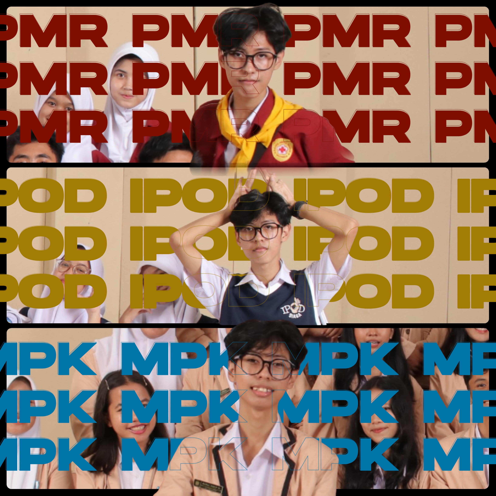

## Prolog

Projek ini saya kerjakan di sekitar Tahun 2022,saya menyadari bahwa beberapa orang memiliki rahasianya masing-masing dan saya tidak ingin terlibat dengan rahasia pribadi mereka.namun sebagian orang sengaja meninggalkan jejak rahasia ini. 

## Tujuan dan Proses Projek

Saya melakukan analisis struktur sekolah dan jaringan sekolah di setiap jam bel istirahat .Dimana saya menemukan bahwa Sekolah adalah tempat yang kuat akan kenangan namun ketika itu semua berakhir ,mereka akan melupakannya,sama halnya seperti saya menemukan banyak note note yang berisi kredensial seperti password dan lainnya namun tidak ada yang mengkhawatirkan hal tersebut

Selain Melakukan Analisis saya melakukan beberapa cara dari Membangun Trust dan meningkatkan beberapa skill yang belum saya kuasai diselang waktu yang ada,dimana saya juga membantu orang tua saya berjualan *Moring* dan *Nasi Bakar* , saya lebih di kenal sebagai *Tukang Nasi Bakar* disekolahan, karna opurtunitas ini,saya berhasil untuk membangun relationship dan membangun Charisma.Kita juga tahu bahwa alat terbaik untuk mencari sisi diri orang lain adalah *Gosip* atau Obrolan dari orang ke orang.

Dengan mengikuti Organisasi Sekolah (MPK) Selama 3 Tingkat dan Organisasi Extrakulikuler PMR dan IPOD, saya mendapatkan skill untuk berkomunikasi level-up untuk melakukan **Manipulasi Pembicaraan**  ditambah relationship dari Organisasi sekolah yang saya masuk.Saya tidak menunjukkan hal Manipulasi ke teman terdekat saya dan teman kelas saya.

## Menghadapi Tantangan dan Penutupan Proyek

Dalam Proses Melakukan Projek ini saya juga mendapatkan beberapa masalah seperti teman-teman saya yang menganggap bahwa saya orang yang aneh dan tentu mereka juga tidak peduli apa yang sedang saya lakukan jadi saya tidak ingin mengambil pusing soal sikap mereka,karena selagi jam istirahat saya  menghabiskan sebagian waktu saya untuk melakukan live coaching soal Cyber Security agar mereka aman

Projek ini berakhir dengan berakhir nya text ini di upload,saya juga tidak akan menyebar data-data yang sudah saya ambil ,namun tetap saya gunakan untuk mengenali kalian lebih **Dalam** lagi ,itulah mengapa saya melakukan projek ini agar suatu saat ada seseorang yang benar benar mengenali saya lebih dari saya mengenali diri saya sendiri.

